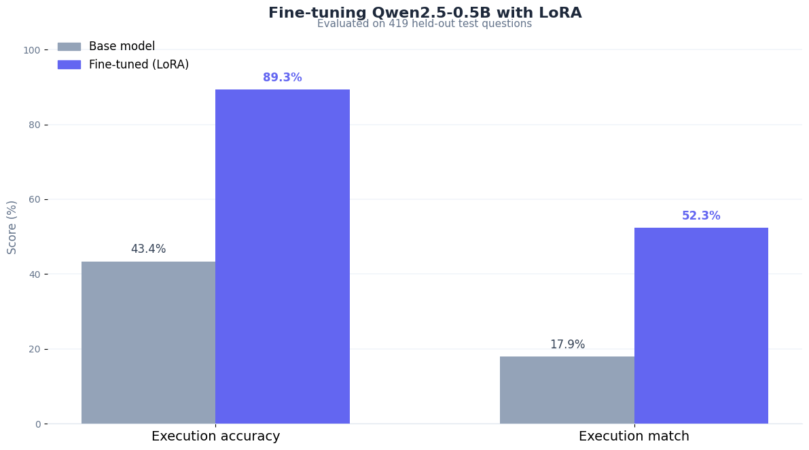
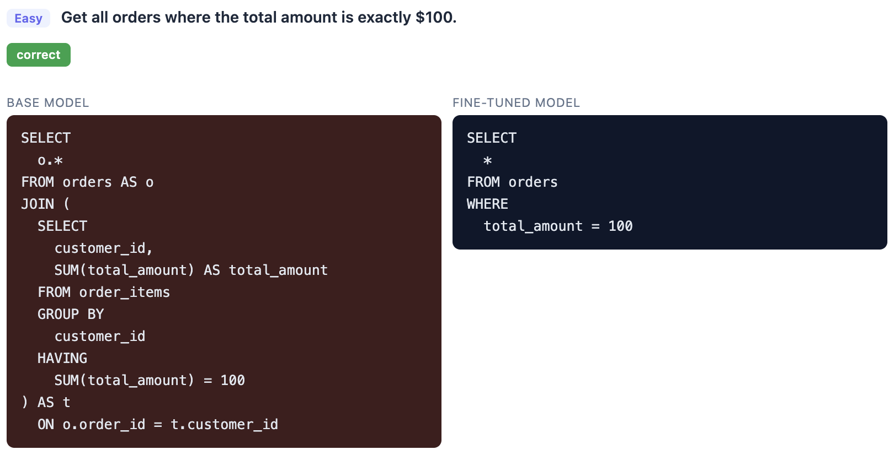

# Natural-Language-to-SQL with LoRA

Fine-tuning **Qwen2.5-0.5B-Instruct** with LoRA to translate plain-English
questions into correct **PostgreSQL** queries. Trained and evaluated entirely
on a consumer laptop.

## Results

Evaluated on **419 held-out test questions** against a live database:

| Metric | Base model | Fine-tuned (LoRA) | Gain |
|---|---|---|---|
| Execution accuracy (query runs) | 43.4% | 89.3% | +45.9 pts |
| **Execution match (correct rows)** | **17.9%** | **52.3%** | **+34.4 pts** |

By difficulty (execution match): easy 36% to 86%, medium 23% to 52%,
hard 2% to 37%, very-hard 11% to 32%.



**Example — base model vs fine-tuned on the same question:**



For the full write-up (per-difficulty breakdown, failure analysis, example
queries), run `uv run python generate_report.py` to build `report.html`.

## Setup

Dependencies are managed with [`uv`](https://docs.astral.sh/uv/):

```bash
uv sync
```

Copy `.env.example` to `.env` and fill in your OpenAI API key and PostgreSQL
connection details:

```bash
cp .env.example .env
```

## The database

A 5-table sales schema (`customers`, `orders`, `products`, `employees`,
`order_items`). Create and seed it with:

```bash
psql -d your_db -f schema.sql   # create tables (re-running resets them)
uv run python seed.py           # populate with synthetic rows
```

## Pipeline

| Step | File | What it does |
|---|---|---|
| 1 | `download.ipynb` | Download the Qwen2.5-0.5B-Instruct base model to `models/` |
| 2 | `create_sql_dataset.ipynb` | Generate the NL-to-SQL dataset with an LLM |
| 3 | `clean_dataset.py` | Fix MySQL-isms, validate every query against the DB, drop failures |
| 4 | `finetune_lora.ipynb` | LoRA fine-tune the base model, writes `lora_output/` |
| 5 | `evaluate.py` | Evaluate base vs fine-tuned, writes `eval_results.json` |
| 6 | `generate_report.py` | Build `report.html` from the eval results |
| 7 | `model_examples.ipynb` | Browse side-by-side base / fine-tuned / gold outputs |

Run the eval and report:

```bash
uv run python evaluate.py        # ~1.5h on CPU, writes eval_results.json
uv run python generate_report.py # writes report.html
```

## Key details

- **LoRA config:** rank 4, alpha 8, on `q_proj` / `v_proj` (~270K trainable params).
- **Training:** 2 epochs, completion-only loss, gradient checkpointing,
  adafactor optimizer, fp16, tuned to fit in limited memory.
- **Dataset** (`dataset_output/`): 1968 train / 424 validation / 419 test.
  LLM-generated, then cleaned so all reference queries execute on the live DB.
- **Evaluation metrics:** *execution accuracy* (the query runs) and
  *execution match* (it returns the same rows as the gold query). Model
  responses are passed through a SQL extractor first, so the base model is
  scored fairly rather than being penalized for Markdown formatting.

## Repo layout

```
schema.sql / seed.py        PostgreSQL schema + seeding
schema_prompt.txt           schema description fed to the model in prompts
dataset_output/             cleaned train / validation / test splits
models/                     downloaded base model (gitignored)
lora_output/                trained LoRA adapter
eval_results.json           per-sample evaluation output (generated, gitignored)
report.html                 evaluation report (generated, gitignored)
logs/                       timestamped run logs (gitignored)
```

## License

Project code is released under the MIT License (see `LICENSE`). The
Qwen2.5-0.5B-Instruct base model keeps its own license, included at
`models/qwen2.5-0.5b-instruct/LICENSE`.
